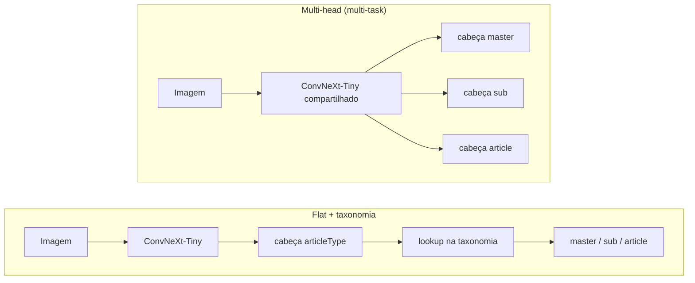

# Classificador hierárquico de produtos de e-commerce

## Em Produção!

[](https://github.com/tf-ferreira/hierarchical-product-classifier/actions/workflows/ci.yml)
[](https://www.python.org/)
[](LICENSE)
[](https://docs.fast.ai/)
[](https://github.com/astral-sh/ruff)

Comparação experimental controlada entre duas arquiteturas para classificação
hierárquica de imagens de produtos (**flat + taxonomia** vs. **multi-head
multi-task**), com fastai + timm (ConvNeXt-Tiny) sobre o dataset
[Fashion Product Images](https://www.kaggle.com/datasets/paramaggarwal/fashion-product-images-small).

> **Demo interativo:** [Streamlit Cloud](https://hierclf-demo.streamlit.app) (envie a foto de um produto e receba os três níveis da taxonomia) ·
> **Modelo publicado:** [Hugging Face Hub](https://huggingface.co/thf-thiago/hierarchical-product-classifier)

## O problema

Catálogos de e-commerce organizam produtos em taxonomias hierárquicas:

```
masterCategory  →  subCategory  →  articleType
Apparel         →  Topwear      →  Tshirts
Footwear        →  Shoes        →  Casual Shoes
```

Classificar automaticamente a partir da imagem alimenta cadastro de produtos,
matching entre catálogos e detecção de produtos mal categorizados, problemas
centrais em precificação e marketplace, área em que trabalhei em consultoria
de pricing. A pergunta deste projeto: **vale a pena um modelo que prevê os três
níveis simultaneamente, ou basta prever o nível fino e derivar o resto?**

## As duas abordagens



| | Flat + taxonomia | Multi-head (multi-task) |
|---|---|---|
| Arquitetura | 1 cabeça sobre `articleType` | 3 cabeças sobre backbone compartilhado |
| Níveis superiores | derivados por lookup na taxonomia | previstos independentemente |
| Consistência hierárquica | **100% por construção** | medida empiricamente (métrica deste estudo) |
| Loss | CE com label smoothing | soma ponderada de 3 CEs com label smoothing |
| Hipótese | simplicidade vence | supervisão grossa regulariza o nível fino |

Uma terceira opção, cascata de modelos (um por nível, condicionados), foi
descartada de saída: multiplica custo de treino, inferência e manutenção sem
hipótese clara de ganho neste dataset.

**Desenho experimental:** tudo exceto a cabeça é idêntico entre os dois
experimentos, mesmo backbone, mesma augmentation, mesma seed e, portanto, o
mesmo split estratificado de validação. O diff entre `configs/flat.yaml` e
`configs/multihead.yaml` é a definição exata do experimento.

## Resultados

Validação estratificada (20%, seed 42), ConvNeXt-Tiny a 224 px, ~3 h de
fine-tuning por experimento em uma Tesla T4. Números completos em
`experiments/runs.csv` e nos `evaluation.json` de cada run.

| Experimento | acc master | acc sub | acc article | consistência hierárquica |
|---|---|---|---|---|
| flat + taxonomia | **99,6%** | **97,2%** | **90,1%** | **100%** (por construção) |
| multi-head | 99,3% | 94,1% | 83,1% | 96,3% |

O flat venceu nos três níveis. A leitura: com uma taxonomia limpa em mãos,
prever apenas o nível mais fino e derivar os superiores é melhor do que
dividir a capacidade do modelo entre três objetivos — a loss combinada do
multi-head disputa gradiente entre cabeças redundantes (o nível fino já
determina os demais) e ainda paga 3,7 p.p. de inconsistência hierárquica,
um modo de erro que o flat elimina por construção. As confusões restantes
do flat são pares genuinamente ambíguos visualmente (Sports × Casual Shoes,
Tshirts × Tops, Kurtas × Kurtis).

Análise de erros (matriz de confusão, top confusões e `top_losses`
interpretados) em `notebooks/02_error_analysis.ipynb` e `reports/figures/`.

## Estrutura do repositório

```
├── configs/            # experimentos declarativos (YAML); o diff é o experimento
├── src/hierclf/
│   ├── taxonomy.py     # fonte única da verdade da hierarquia (puro, testado)
│   ├── tracking.py     # logging próprio: JSON por run + runs.csv consolidado
│   ├── data.py         # download, validação com relatório, split, DataLoaders
│   ├── model.py        # ConvNeXt-Tiny, cabeça tripla, loss combinada, métricas
│   ├── train.py        # seeds, lr_find, fine-tuning em 2 fases, callbacks
│   ├── evaluate.py     # acurácia por nível, consistência, top confusões
│   └── inference.py    # contrato de predição único para as duas abordagens
├── tests/              # pytest; roda sem GPU e sem fastai
├── notebooks/          # 01: EDA · 02: análise de erros (a lógica vive no pacote)
├── app/                # demos: Streamlit (Streamlit Cloud) e Gradio (local)
└── reports/figures/    # figuras versionadas citadas neste README
```

## Como reproduzir

Pré-requisitos: Python 3.10+, credenciais do Kaggle em `~/.kaggle/kaggle.json`
(Kaggle → Settings → API → Create New Token) e uma GPU para o treino (uma T4
de 16 GB é suficiente).

```bash
git clone https://github.com/tf-ferreira/hierarchical-product-classifier.git
cd hierarchical-product-classifier
make setup   # pip install -e ".[dev]"
make test    # suíte de testes (não exige GPU)

# Treino (GPU recomendada):
make train-flat
make train-multihead
make evaluate RUN=experiments/multihead-<run_id>

# Demo local com o run vencedor:
make app RUN=experiments/multihead-<run_id>
```

Cada run grava em `experiments/<nome>-<run_id>/`: `config.json` (snapshot
completo, incluindo seed e ambiente), `metrics.jsonl` (uma linha por época,
append-only), `taxonomy.json`, o modelo exportado e `evaluation.json`. A tabela
consolidada de todos os runs fica em `experiments/runs.csv`.

## Decisões técnicas (e porquês)

- **ConvNeXt-Tiny (timm):** melhor acurácia por parâmetro que ResNet50 na
  mesma faixa de custo; treina confortavelmente em uma única GPU T4.
- **Fine-tuning em 2 fases com discriminative learning rates:** cabeças
  aleatórias primeiro (backbone congelado), depois rede inteira com taxas
  menores nas camadas iniciais. Evita destruir features pré-treinadas.
- **`lr_find` com heurística valley, sempre logado:** a escolha do learning
  rate é uma decisão registrada por run, não um número mágico.
- **Split estratificado por `articleType` com seed fixa:** o dataset tem cauda
  longa; split aleatório simples deixaria classes raras sem validação.
- **Vocabulários explícitos nos `CategoryBlock`s:** mesmo mapeamento
  índice→classe em todos os runs e na inferência.
- **Validação de dados com contabilidade:** linhas malformadas do
  `styles.csv`, imagens ausentes e classes raras removidas são contadas e
  reportadas, nunca descartadas em silêncio (ver `DataReport` em `data.py`).
- **Tracking próprio (JSON/CSV) em vez de serviço externo:** zero dependência,
  artefatos versionáveis, e o formato JSONL por época é robusto a interrupções
  do ambiente de treino. Trade-off assumido: sem dashboards; para dezenas de
  runs, suficiente.
- **Modelos fora do Git:** dados são reprodutíveis via Kaggle e pesos vivem no
  Hugging Face Hub; no Git ficam código, configs e resultados agregados.

## Limitações conhecidas

Ver [MODEL_CARD.md](MODEL_CARD.md). Em resumo: o modelo aprende com fotos de
catálogo (fundo claro, produto centralizado); há um domain gap real para fotos
de usuário em ambiente natural, e a taxonomia é a de um catálogo específico de
moda, não uma ontologia universal de produtos.

## Licença

[MIT](LICENSE).

## Autor

**Thiago Ferreira**, cientista de dados (ML aplicado a pricing e varejo).
Bacharel em Matemática Aplicada e Computação Científica (ICMC/USP), MBA em
Data Science and Analytics (ESALQ/USP, em andamento).

[GitHub](https://github.com/tf-ferreira) · [LinkedIn](https://www.linkedin.com/in/tf-ferreira) · thiagoferreira9594@gmail.com
